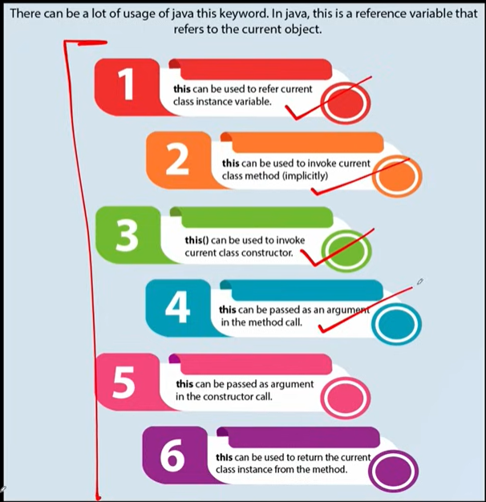
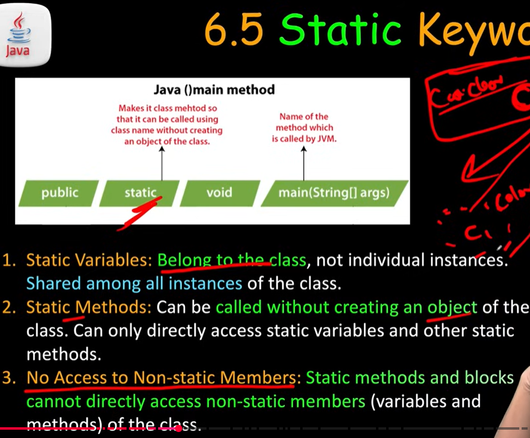

Car myCar; ---> car class er referense name
myCar = new Car();  ---> new Car(): object create hoise. Then obj er address referense e rakha hosie
Car(); ---> constructor

this:

static:
static field k static/ non-static 2 ta tei access kra zy
non-static k static er vitor apply kra zy na

